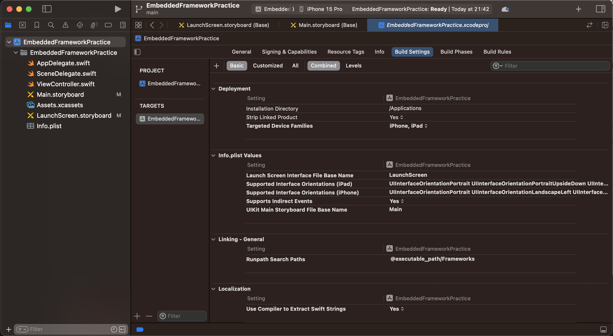
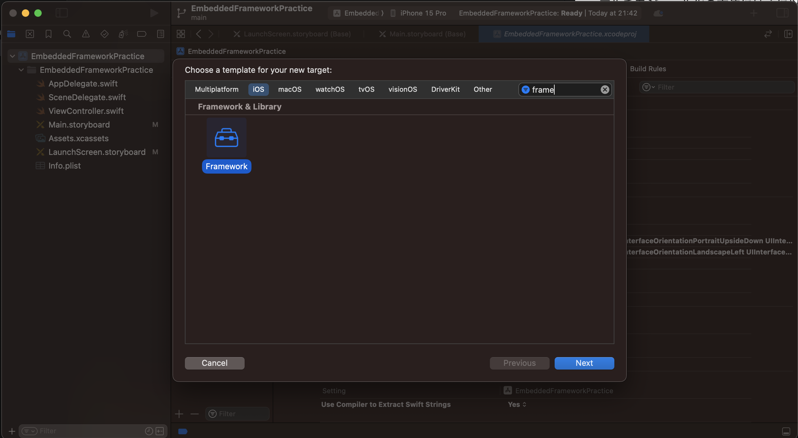
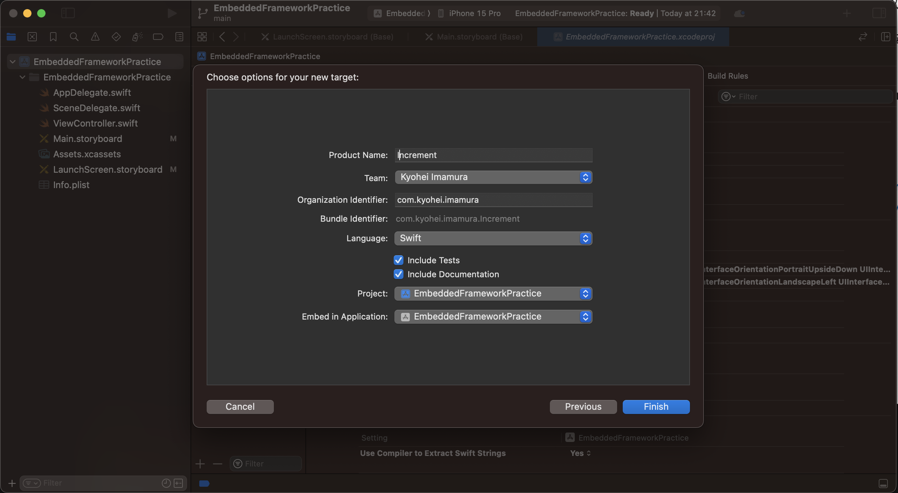
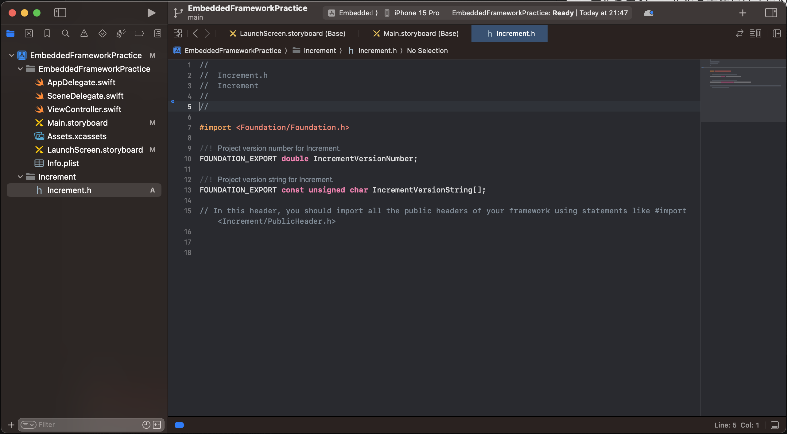

# マルチモジュール化練習用プロジェクト

### マルチモジュール化
マルチモジュール化の方法として以下の2つの方法がある
- Embedded Framework を利用する方法
- Swift Package を利用するやり方

このプロジェクトでは Embedde Framework を使用している

### Embedde Framework の手順
1. TARGETS 左下の + ボタンから Target を追加

2. Framework を選択して Next

3. Increment Framework を作成

4. 完了すると Increment ディレクトリが作成される

### Framework でのコード実装
- 作成した Framework を Framework 外から使用する場合は、import で読み込む
- Framework 外からアクセスするクラス、メソッド、プロパティなどには public のアクセス制限をつける

参考:
- https://tokizuoh.hatenablog.com/entry/2022/11/03/151238
- https://blog.mothule.com/ios/ios-embedded-framework
- https://moneyforward-dev.jp/entry/2021/11/11/private-cocoapods-library/

